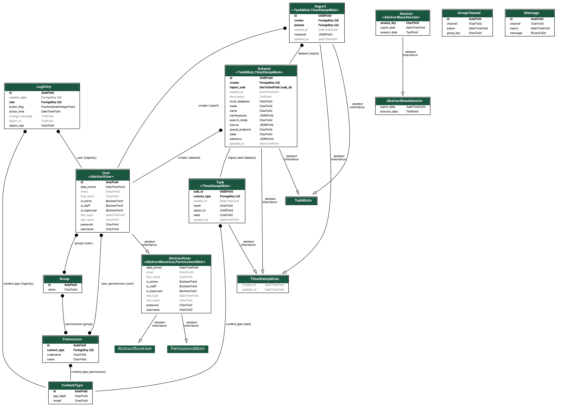

# Project Structure
This document is aimed to be a quick introduction to help a potentially new contributor understand how to navigate this project.

## File Organization
The projects files are organized in the following way:

- `backend`: Contains the `Django` backend and worker source code.
- `dev`: Contains the development scripts and docker configs.
- `docs`: Contains the `mkdocs` documentation.
- `frontend`: Contains the `react` frontend source code.
- `storage`: Is the directory where the BOLD runtime files are stored.
- `tools`: Contains `rust` based BOLD cli tools for RDF preprocessing and search indexing.

## Backend Structure
The BOLD backend is split into multiple modules that are responsible for different parts of the BOLD system.

- `backend`: Contains the `Django` and `celery` configuration.
- `datasets`: Is responsible for all dataset related operations such as import and management.
- `frontend`: Contains static files generated by the `react` frontend.
- `reports`: Is responsible for all report related operations such as management and cell execution.
- `shared`: Contains shared utility code used by all the modules.
- `tasks`: Contains framework for asynchronous execution and tracking of tasks.
- `users`: Contains all user related operations such as authentication and management.

## Frontend Structure
The BOLD frontend follows standard react and typescript conventions for code organization.

- `components`: Contains all the UI components which can be used in any context.
- `containers`: Contains all the UI containers which combine multiple components into combined user interfaces.
- `hooks`: Contains hooks for data from state extraction.
- `pages`: Holds complete pages used in navigation and frontend.
- `providers`: Contains all the data providers and hooks used for managing state of the application.
- `services`: Holds service apis for the backend, LODC and TriplyDB.
- `theme`: Contains the mui theme configuration.
- `types`: Contains typescript type definitions for data structures used in the application.
- `utils`: Contains utility functions.
- `App.tsx`: The main entry point for the application.

## Models

- *Dataset* - The dataset model is used to manage the data sources and local datasets. It stores handles to local and remote resources.
- *Report* - The report model is used to manage the reports. It stores the cells and the results of the cells in the notebook json field.
- *Task* - The task model represents a scheduled task. It stores a handle to the celery task and the information about the task status.
